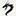

<p align="center">
    <br>
    <b>Kurimuzon-Userbot</b>
    <br>
    <b>Telegram userbot inspired by <a href='https://github.com/Dragon-Userbot/Dragon-Userbot'> Dragon-Userbot</a></b>
    <br>
    
    
</p>

<h1>About</h1>
<p>Kurimuzon-Userbot is a Telegram userbot (in case you didn't know, selfbot/userbot are used to automate user accounts).
So how does it work? It works in a very simple way, using the pyrogram library, a python script connects to your account (creating a new session) and catches your commands.

Using selfbot/userbot is against Telegram's Terms of Service, and you may get banned for using it if you're not careful.

The developers are not responsible for any consequences you may encounter when using Kurimuzon-Userbot. We are also not
responsible for any damage to chat rooms caused by using this userbot.</p>

<h1>Installation</h1>
<h2>Linux and Windows [only wsl]</h2>

```bash
apt-get update && apt-get upgrade -y && apt install git && git clone https://github.com/KurimuzonAkuma/Kurimuzon-Userbot && cd Kurimuzon-Userbot/ && bash install.sh
```

<h2>Manual</h2>
<ul>
<li>Clone repository from github</li>
<li>Go to folder with userbot and rename .env.example -> .env</li>
<li>Start userbot with python3 main.py</li>
</ul>

Subsequent launch:
<pre><code>cd Kurimuzon-Userbot/</code></pre>
<pre><code>python3 main.py</code></pre>

<h2>Credits</h2>
<nav>
<li><a href='https://github.com/john-phonk'>john-phonk</a></li>
<li><a href='https://github.com/Taijefx34'>Taijefx34</a></li>
<li><a href='https://github.com/LaciaMemeFrame'>LaciaMemeFrame</a></li>
<li><a href='https://github.com/iamnalinor'>nalinor</a></li>
<li>asphy <a href='https://t.me/LKRinternationalrunetcomphinc'>tg</a> and <a href='https://ru.namemc.com/profile/asphyxiamywife.1'>namemc</a></li>
<li><a href='http://t.me/fuccsoc'>fuccsoc</a></li>
</nav>
<h4>Written on <a href='https://github.com/pyrogram/pyrogram'>Pyrogram❤️</a></h4>
